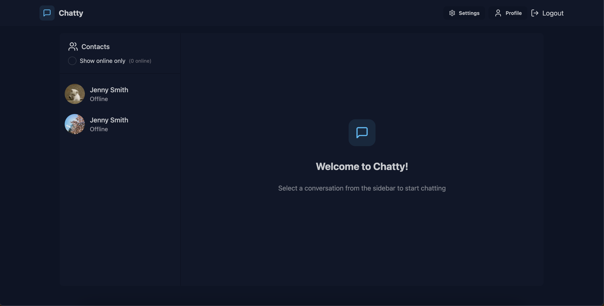
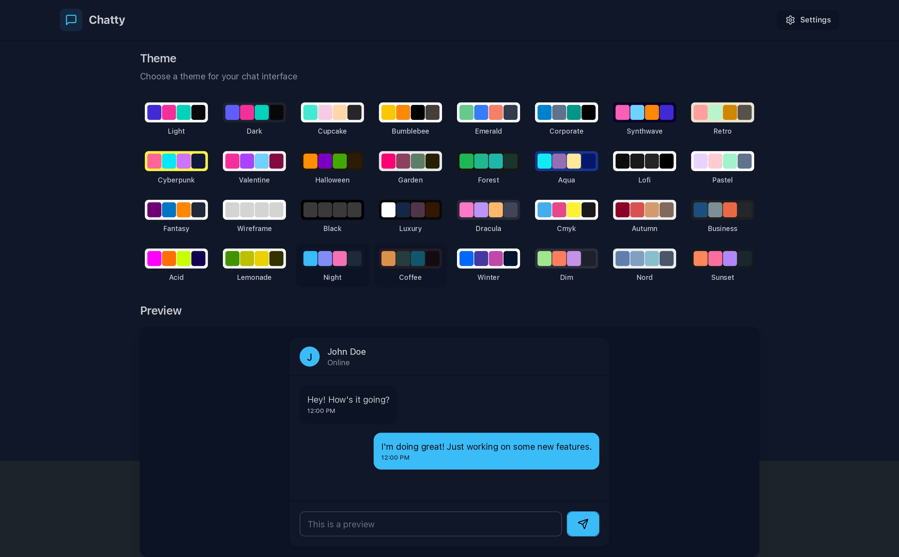

# chatty




## Tech Stack

1. **Mongo**: For utility-first, responsive, and modern styling.
2. **Express**: For adding static typing to JavaScript and more.
3. **React.js (Vite)**: For building dynamic and interactive user interfaces.
4. **Node.js**: For structuring UI components in a declarative way.
4. **Socket.io**: For structuring UI components in a declarative way.

## Usage

Clone it :

```
$ git clone https://github.com/Dibyaranjan450/chatty.git
```

Visit the page at :

```
https://chatty-frontend-yc65.onrender.com
```

## Contributor

- Creator of evogym [@Dibyaranjan450](https://github.com/Dibyaranjan450)


## ⚠️ Disclaimer

**Compatibility Warning**: This project may not function properly in Safari due to it's strict cookie policy. Try using Chrome or Firefox instead!
